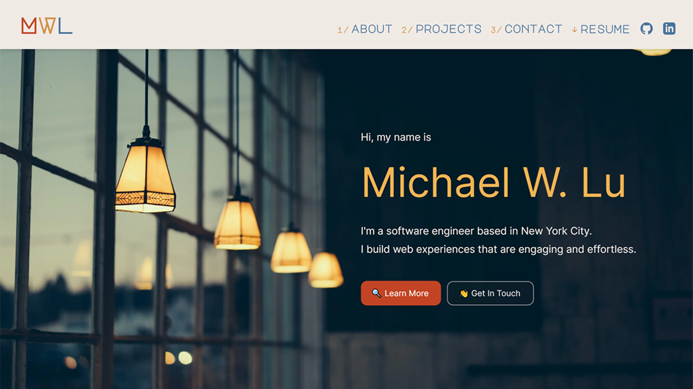
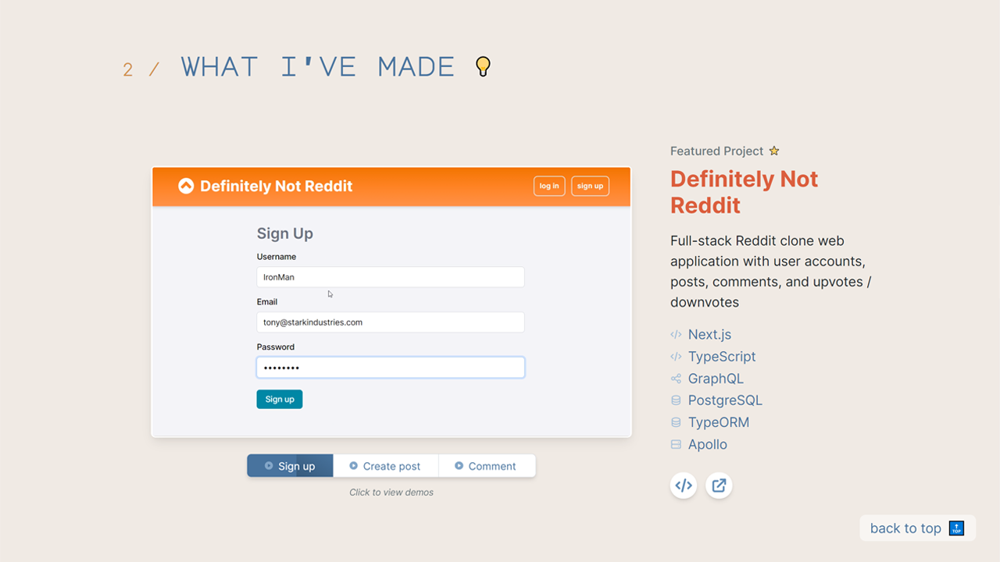

# Michael W. Lu

Visit at: [michaelwenlu.com](https://michaelwenlu.com)

---

## 📝 Description

This is my personal website serving as my programming portfolio.

Much structural and design inspiration came from [Brittany Chiang's impeccable personal site](https://github.com/bchiang7/v4). I put together a warm theme which was heavily influenced by the unique portrayal of futurism and technology in the film _Her_.

&nbsp;

In showcasing my coding projects, I took a great piece of advice from [Aaron Jack's YouTube channel](https://www.youtube.com/channel/UCRLEADhMcb8WUdnQ5_Alk7g) and used screen recordings to easily display my applications' capabilities in demo videos.

## 🤖 Versions

v1.0 Deploy site

## 🚀 Technologies

- [Next.js](https://nextjs.org/)
- [Formspree](https://formspree.io/)
- [Tailwind CSS](https://tailwindcss.com/)
- [Vercel](https://vercel.com/docs)

## 🗃️ License

MIT © 2020 Michael W. Lu
